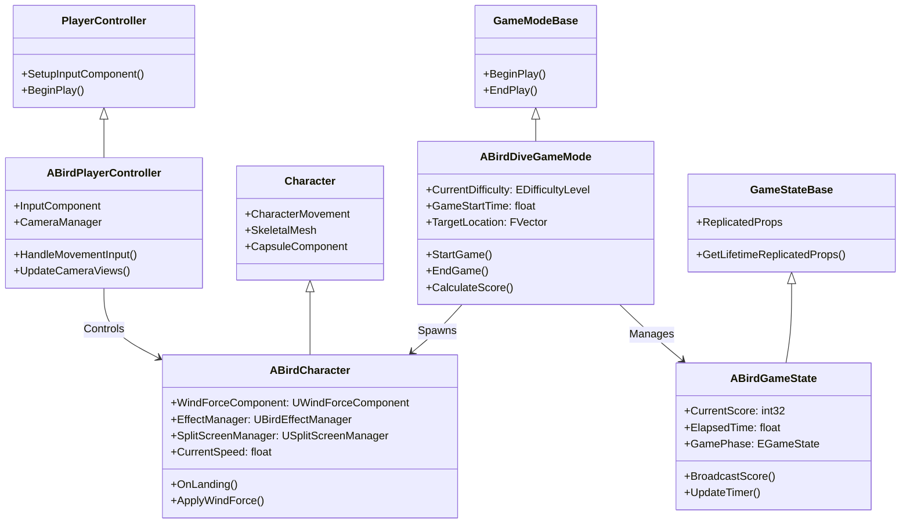

# Bird Dive Challenge Blueprint設計

## クラス階層構造



## Blueprint クラス設計

### 1. ゲームモード系 Blueprints

#### BP_BirdDiveGameMode
```
継承: ABirdDiveGameMode (C++)

主要機能:
- ゲーム開始/終了処理
- 難易度設定の適用
- スコア計算システム
- リザルト表示制御

主要変数:
- Difficulty Settings (FDifficultySettings)
- Target Actors (TArray<AActor*>)
- Current Game Session (FGameSessionData)
- Score Multipliers (TMap<EDifficultyLevel, float>)

主要イベント:
- Event BeginPlay: ゲーム初期化
- Event StartGameplay: ゲーム開始処理
- Event OnBirdLanded: 着地時処理
- Event CalculateFinalScore: 最終スコア算出
- Event ShowResults: リザルト画面表示

カスタム関数:
- InitializeGameSession(): セッション初期化
- SpawnTargets(): 的の配置
- ApplyDifficultySettings(): 難易度適用
- ValidateLanding(): 着地判定
- TriggerGameOver(): ゲーム終了処理
```

#### BP_BirdGameState
```
継承: ABirdGameState (C++)

主要機能:
- ゲーム状態の管理
- リアルタイムデータ更新
- UI情報の提供
- 統計データ収集

主要変数:
- Real Time State (FRealTimeGameState)
- Performance Metrics (FArray<float>)
- Active Notifications (TArray<FString>)
- Debug Display Flags (bool)

主要イベント:
- Event UpdateGameTimer: タイマー更新
- Event UpdateScore: スコア更新
- Event BroadcastGameState: 状態配信
- Event AddNotification: 通知追加

カスタム関数:
- GetCurrentGameTime(): 現在時刻取得
- GetFormattedScore(): フォーマット済みスコア
- IsGameActive(): ゲーム進行中判定
- GetPerformanceStats(): パフォーマンス統計
```

### 2. キャラクター系 Blueprints

#### BP_BirdCharacter
```
継承: ABirdCharacter (C++)

コンポーネント構成:
- Skeletal Mesh Component (鳥のメッシュ)
- Character Movement Component (カスタム移動)
- Wind Force Component (風力計算)
- Split Screen Manager (カメラ管理)
- Bird Effect Manager (エフェクト管理)
- Audio Component (サウンド再生)
- Collision Sphere (着地判定)

主要変数:
- Current Flight State (EFlightState)
- Input Deadzone (float)
- Max Control Force (float)
- Landing Tolerance (float)
- Animation State Variables

主要イベント:
- Event BeginPlay: 初期化
- Event Tick: 毎フレーム処理
- Event OnHit: 衝突処理
- Event ReceiveMovementInput: 入力受信
- Event OnSpeedChanged: 速度変化時

カスタム関数:
- UpdateFlightPhysics(): 飛行物理更新
- ProcessPlayerInput(): プレイヤー入力処理
- CheckLandingConditions(): 着地条件確認
- UpdateAnimationState(): アニメーション状態更新
- TriggerLandingEffects(): 着地エフェクト発火
- ValidateFlightParameters(): 飛行パラメータ検証
```

#### BP_BirdCharacterAnimBP
```
継承: UAnimInstance

アニメーション変数:
- Is Flying (bool)
- Flight Speed (float)
- Wing Flap Rate (float)
- Body Pitch (float)
- Body Roll (float)
- Landing Transition (float)

ステートマシン:
1. Idle State
   - Conditions: Speed < 10
   - Animations: Idle Pose
   
2. Flying State
   - Conditions: Speed >= 10 && !IsLanding
   - Animations: Wing Flap Cycle
   
3. Gliding State
   - Conditions: Speed > 200 && InputMagnitude < 0.1
   - Animations: Glide Pose
   
4. Turning State
   - Conditions: InputMagnitude > 0.5
   - Animations: Banking Animation
   
5. Landing State
   - Conditions: IsLanding == true
   - Animations: Landing Sequence

ブレンドスペース:
- Flight_BS: Speed (0-1000) × Input Direction (-1 to 1)
- Wing_Flap_BS: Wing Flap Rate (0.5-2.0)

Control Rig統合:
- Wing Procedural Animation
- Body Orientation Adjustment
- Tail Feather Control
```

### 3. カメラ系 Blueprints

#### BP_SplitScreenCamera
```
継承: USplitScreenManager (C++)

カメラ構成:
- First Person Camera Component
- Side View Camera Component  
- Post Process Component (FP用)
- Scene Capture Component 2D (サイド用)

主要変数:
- Split Ratio (float): 画面分割比率
- Camera Settings (FCameraSettings)
- Current Speed Ratio (float)
- Distortion Strength (float)

主要イベント:
- Event UpdateCameras: カメラ更新
- Event ApplySpeedEffects: 速度エフェクト適用
- Event SwitchViewMode: ビューモード切替

カスタム関数:
- CalculateFirstPersonTransform(): FP位置計算
- CalculateSideViewTransform(): サイド位置計算
- UpdateFOVBasedOnSpeed(): 速度連動FOV
- ApplyPostProcessEffects(): ポストプロセス適用
- BlendCameraTransitions(): カメラ遷移ブレンド
```

### 4. UI系 Blueprints

#### WBP_GameplayHUD
```
継承: UUserWidget

UI要素:
- Score Text (UTextBlock)
- Timer Text (UTextBlock)
- Speed Meter (UProgressBar)
- Target Distance Indicator (UImage)
- Warning Messages Panel (UVerticalBox)
- Debug Info Panel (UCanvasPanel)

バインディング変数:
- Current Score (int32)
- Elapsed Time (float)  
- Current Speed (float)
- Max Speed (float)
- Distance to Target (float)
- Warning Message (FText)
- Show Debug Info (bool)

主要イベント:
- Event Construct: UI初期化
- Event OnScoreUpdated: スコア更新時
- Event OnTimerUpdated: タイマー更新時
- Event OnSpeedChanged: 速度変化時
- Event ShowWarning: 警告表示
- Event UpdateDebugInfo: デバッグ情報更新

カスタム関数:
- FormatScore(): スコア文字列化
- FormatTimer(): タイマー文字列化
- UpdateSpeedMeter(): スピードメーター更新
- ShowSpeedWarning(): 速度警告表示
- ToggleDebugDisplay(): デバッグ表示切替
```

#### WBP_MainMenu
```
継承: UUserWidget

UI要素:
- Title Image (UImage)
- Difficulty Selection (UHorizontalBox)
  - Easy Button (UButton)
  - Normal Button (UButton)  
  - Hard Button (UButton)
- Start Game Button (UButton)
- Settings Button (UButton)
- Quit Button (UButton)
- High Scores Panel (UScrollBox)

主要変数:
- Selected Difficulty (EDifficultyLevel)
- High Score Entries (TArray<FHighScoreEntry>)
- Menu Animation State (float)

主要イベント:
- Event OnDifficultySelected: 難易度選択時
- Event OnStartGameClicked: ゲーム開始ボタン
- Event OnSettingsClicked: 設定ボタン
- Event OnQuitClicked: 終了ボタン

カスタム関数:
- PopulateHighScores(): ハイスコア一覧作成
- UpdateDifficultyDisplay(): 難易度表示更新
- PlayMenuAnimation(): メニューアニメーション
- ValidateGameStart(): ゲーム開始可能判定
```

#### WBP_ResultScreen
```
継承: UUserWidget

UI要素:
- Result Title (UTextBlock)
- Final Score Display (UTextBlock)
- Time Display (UTextBlock)
- Landing Quality Image (UImage)
- Performance Stats Panel (UVerticalBox)
- New High Score Badge (UImage)
- Retry Button (UButton)
- Menu Button (UButton)

主要変数:
- Landing Result (FLandingResult)
- Is New High Score (bool)
- Performance Data (FGameSessionData)

主要イベント:
- Event DisplayResults: 結果表示
- Event OnRetryClicked: リトライボタン
- Event OnMenuClicked: メニューボタン
- Event PlayResultAnimation: 結果アニメーション

カスタム関数:
- FormatResultData(): 結果データ整形
- DetermineResultColor(): 結果色決定
- ShowNewHighScoreBadge(): 新記録バッジ表示
- PopulatePerformanceStats(): パフォーマンス統計表示
```

### 5. エフェクト系 Blueprints

#### BP_LandingEffectActor
```
継承: AActor

コンポーネント:
- Scene Root (USceneComponent)
- Niagara Component (UNiagaraComponent)
- Audio Component (UAudioComponent)
- Decal Component (UDecalComponent) [着地跡用]

主要変数:
- Effect Systems (TMap<ELandingQuality, UNiagaraSystem*>)
- Sound Effects (TMap<ELandingQuality, USoundBase*>)
- Decal Materials (TMap<ELandingQuality, UMaterialInterface*>)
- Effect Duration (float)

主要イベント:
- Event PlayLandingEffect: エフェクト再生
- Event OnEffectFinished: エフェクト終了
- Event CleanupEffect: エフェクトクリーンアップ

カスタム関数:
- SelectEffectByQuality(): 品質別エフェクト選択
- ConfigureEffectParameters(): エフェクトパラメータ設定
- StartEffectLifecycle(): エフェクトライフサイクル開始
- ReturnToPool(): プールへ返却
```

### 6. システム系 Blueprints

#### BP_WindSystem
```
継承: AActor

コンポーネント:
- Scene Root (USceneComponent)
- Wind Force Calculator (UWindForceComponent)
- Debug Visualization (UStaticMeshComponent)

主要変数:
- Current Wind Data (FWindData)
- Wind History Buffer (TArray<FWindData>)
- Visualization Enabled (bool)
- Wind Zones (TArray<FWindZone>)

主要イベント:
- Event GenerateWind: 風力生成
- Event UpdateWindVisualization: 風の可視化更新
- Event OnDifficultyChanged: 難易度変更時

カスタム関数:
- CalculateGlobalWind(): グローバル風力計算
- ApplyLocalWindZones(): ローカル風ゾーン適用
- UpdateWindDebugDisplay(): 風デバッグ表示更新
- GetWindAtLocation(): 位置別風力取得
```

#### BP_GameManager
```
継承: AGameModeBase

システム管理:
- Save Manager (UBirdSaveManager)
- Asset Manager (UBirdAssetManager)
- Object Pool (UBirdObjectPool)
- Achievement System (UAchievementManager)

主要変数:
- Game Configuration (UGameConfigDataAsset)
- Current Session Data (FGameSessionData)
- Performance Monitor (FPerformanceData)

主要イベント:
- Event InitializeSystems: システム初期化
- Event ShutdownSystems: システム終了
- Event OnApplicationFocus: アプリケーションフォーカス

カスタム関数:
- PreloadGameAssets(): ゲームアセットプリロード
- InitializeObjectPools(): オブジェクトプール初期化
- StartPerformanceMonitoring(): パフォーマンス監視開始
- CheckSystemHealth(): システムヘルス確認
```

## Blueprint通信パターン

### イベントディスパッチャー
```
ゲームモード → ゲームステート:
- OnGameStarted(EDifficultyLevel)
- OnGameEnded(FLandingResult)
- OnScoreChanged(int32)

鳥キャラクター → UI:
- OnSpeedChanged(float)
- OnLandingApproached(float)
- OnWarningTriggered(FText)

ゲームステート → UI:
- OnTimerUpdated(float)
- OnScoreUpdated(int32)
- OnGameStateChanged(EGameState)
```

### ダイレクト参照
```
PlayerController → BirdCharacter: 入力制御
SplitScreenManager → Cameras: カメラ制御
EffectManager → NiagaraSystems: エフェクト制御
SaveManager → SaveGame: データ永続化
```

### インターフェース通信
```
IBirdGameplayInterface:
- OnGameStarted()
- OnGameEnded()
- OnSpeedWarning()

ICameraControlInterface:
- UpdateCameraTransform()
- ApplyPostProcessEffect()
- SetCameraFOV()
```

## デバッグ・開発支援

### BP_DebugManager
```
デバッグ機能:
- Physics Parameter Visualization
- Performance Stats Display
- Wind Force Vector Rendering
- Flight Path Recording
- Camera Debug Views
- Collision Visualization

開発者コマンド:
- SetDifficulty [Easy/Normal/Hard]
- TeleportToHeight [Height]
- SetWindStrength [Multiplier]
- TogglePhysicsDebug
- ResetHighScores
- SaveCurrentFlight
```

### Blueprint設定のベストプラクティス

1. **パフォーマンス最適化**
   - Event Tick使用の最小化
   - Object Reference Caching
   - Blueprint Nativization適用
   - 不要なCast操作の回避

2. **可読性・保守性**
   - 明確な変数・関数命名
   - 適切なコメント記述
   - カテゴリ分類の統一
   - Blueprint Interface活用

3. **エラー処理**
   - Null Check の徹底
   - IsValid() Node の適切な使用
   - Try-Catch パターンの実装
   - Graceful Degradation

4. **メモリ管理**
   - Object Pooling パターン
   - Timer Handle の適切な管理
   - Delegate のクリーンアップ
   - Asset Reference の最適化