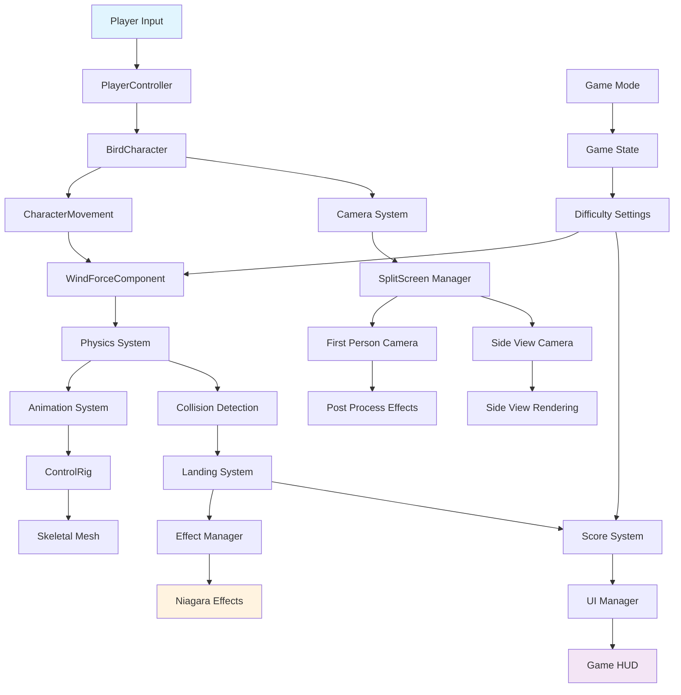
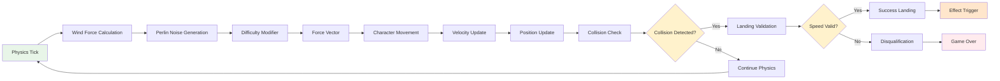
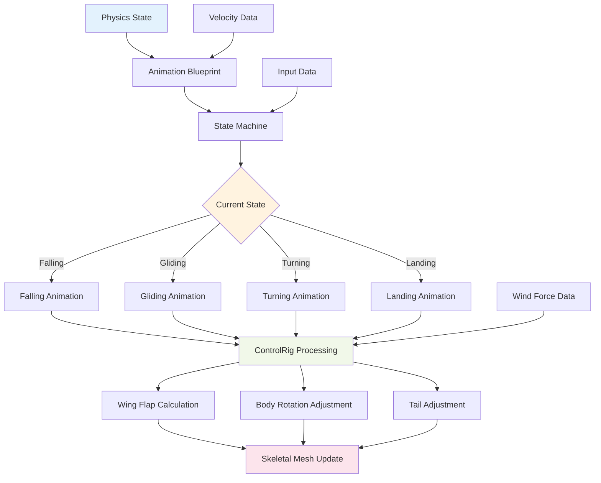
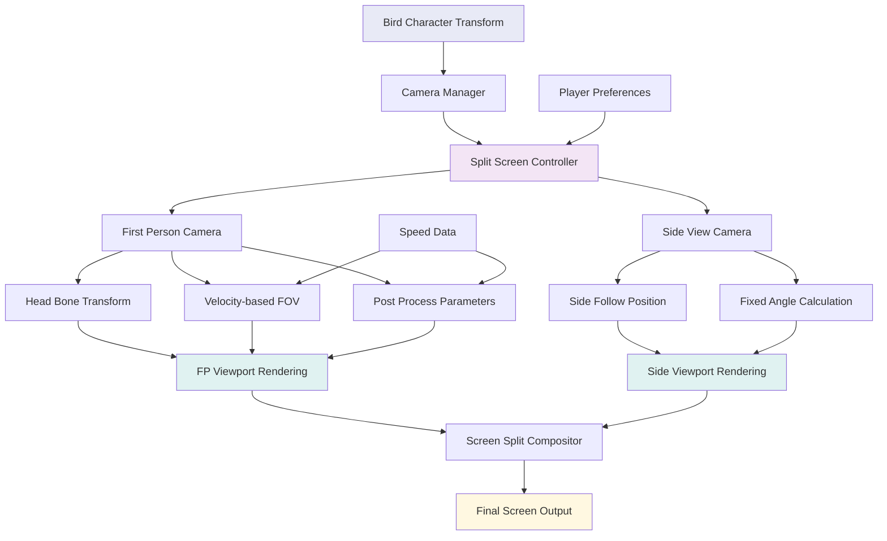
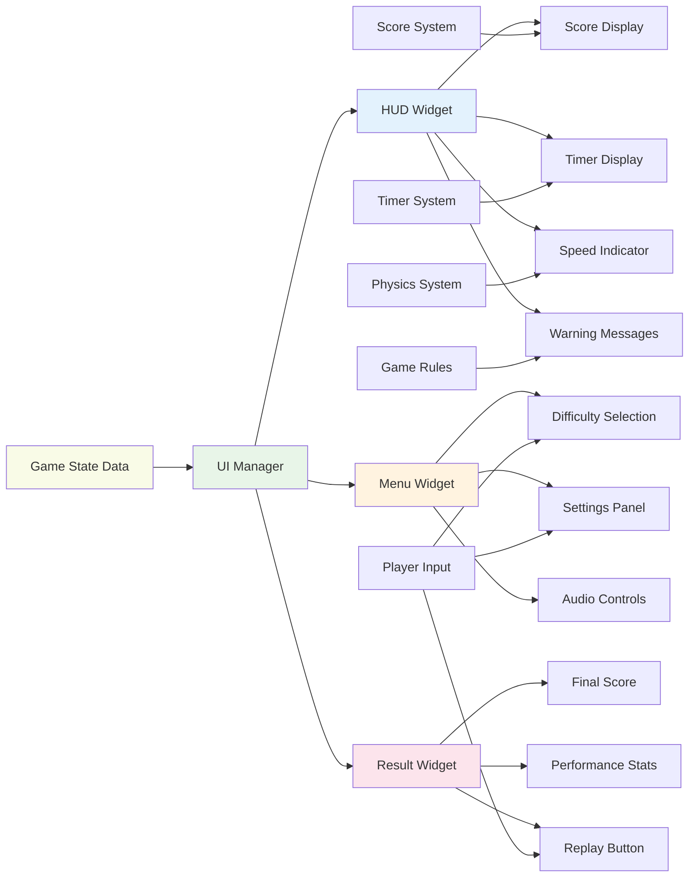
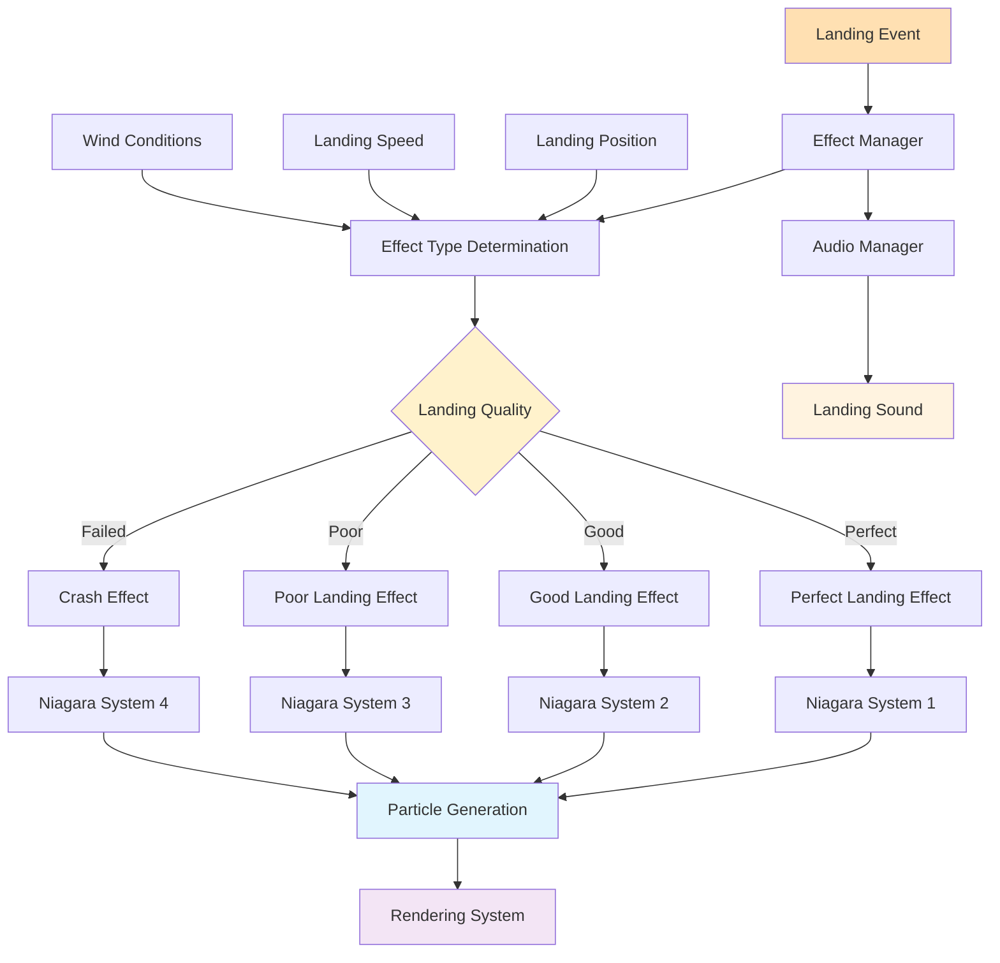
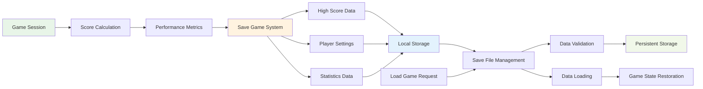
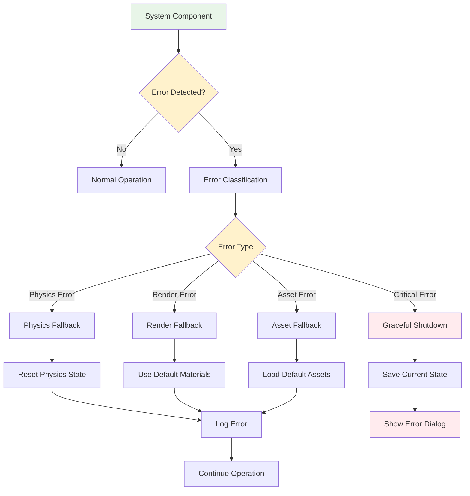

# Bird Dive Challenge データフロー図

## システム全体フロー



## ゲームプレイフロー

```mermaid
sequenceDiagram
    participant P as Player
    participant PC as PlayerController
    participant BC as BirdCharacter
    participant GM as GameMode
    participant GS as GameState
    participant UI as UIManager
    
    P->>PC: Start Game Input
    PC->>GM: Initialize Game
    GM->>GS: Set Initial State
    GM->>BC: Spawn Bird Character
    GS->>UI: Update Timer Display
    
    loop Game Loop
        P->>PC: Movement Input
        PC->>BC: Apply Input Force
        BC->>BC: Calculate Physics
        BC->>BC: Apply Wind Force
        BC->>GS: Update Position
        GS->>UI: Update Score/Timer
        
        alt Bird Lands
            BC->>GM: Landing Event
            GM->>GS: Calculate Final Score
            GS->>UI: Show Result Screen
            break Game End
        end
        
        alt Speed Exceeded
            BC->>GM: Speed Violation Event
            GM->>GS: Set Disqualified State
            GS->>UI: Show Disqualification
            break Game End
        end
    end
```

## 物理システムデータフロー



## アニメーションデータフロー



## カメラシステムデータフロー



## UIデータフロー



## エフェクトシステムデータフロー



## データ永続化フロー



## エラーハンドリングフロー

