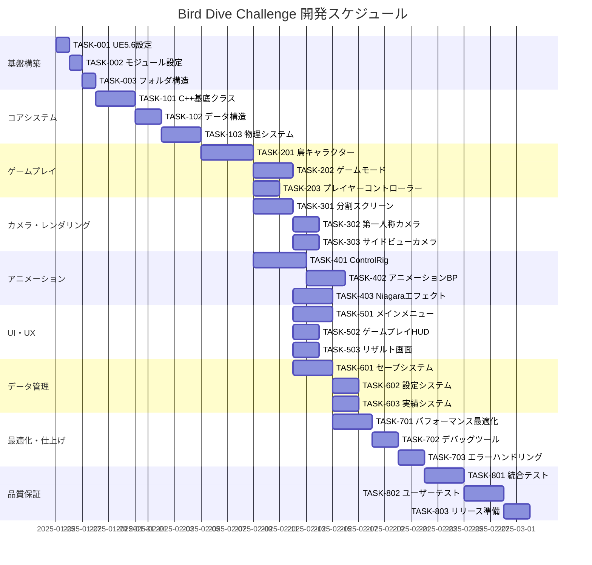

# Bird Dive Challenge 実装タスク

## 概要

全タスク数: 42
推定作業時間: 80-100時間
クリティカルパス: TASK-001 → TASK-002 → TASK-101 → TASK-201 → TASK-301 → TASK-401 → TASK-501

## タスク一覧

### フェーズ1: プロジェクト基盤構築

#### TASK-001: UE5.6プロジェクト初期設定

- [x] **タスク完了**
- **タスクタイプ**: DIRECT
- **要件リンク**: REQ-401, NFR-001
- **依存タスク**: なし
- **実装詳細**:
  - UE5.6でC++プロジェクト作成
  - Git/Git LFS設定とリポジトリ初期化
  - .gitignoreとプロジェクト構造設定
  - Visual Studio 2022統合設定
  - プロジェクト設定（ターゲットプラットフォーム、レンダリング設定）
- **テスト要件**:
  - [x] プロジェクトコンパイル成功テスト
  - [x] エディタ起動確認テスト
  - [x] Git LFS動作確認テスト
- **完了条件**:
  - [x] UE5.6プロジェクトが正常に起動する
  - [x] C++コンパイルが成功する
  - [x] Git管理下に置かれている

#### TASK-002: モジュール・プラグイン設定

- [x] **タスク完了**
- **タスクタイプ**: DIRECT
- **要件リンク**: REQ-401, REQ-402
- **依存タスク**: TASK-001
- **実装詳細**:
  - BirdDiveゲームモジュール作成
  - 必要プラグインの有効化（Niagara, ControlRig, Chaos Physics）
  - プロジェクト設定ファイル（.uproject）の設定
  - モジュール依存関係の設定
- **テスト要件**:
  - [ ] モジュールロードテスト
  - [ ] プラグイン機能利用可能性確認
  - [ ] 依存関係解決確認
- **完了条件**:
  - [ ] 全必要プラグインが有効化されている
  - [ ] カスタムモジュールが正常にロードされる

#### TASK-003: フォルダ構造・命名規則設定

- [x] **タスク完了**
- **タスクタイプ**: DIRECT
- **要件リンク**: NFR-302
- **依存タスク**: TASK-002
- **実装詳細**:
  - Content Browser内のフォルダ構造作成
  - アセット命名規則文書化
  - C++クラスファイル構造整備
  - Blueprint分類ルール設定
- **テスト要件**:
  - [ ] フォルダ構造検証
  - [ ] 命名規則準拠確認
- **完了条件**:
  - [ ] 設計書通りのフォルダ構造が作成されている
  - [ ] 命名規則ドキュメントが完成している

### フェーズ2: コアシステム実装

#### TASK-101: C++基底クラス実装

- [x] **タスク完了**
- **タスクタイプ**: TDD
- **要件リンク**: REQ-001, REQ-005, REQ-401
- **依存タスク**: TASK-003
- **実装詳細**:
  - ABirdDiveGameMode基底クラス実装
  - ABirdDiveGameState基底クラス実装
  - ABirdDivePlayerController基底クラス実装
  - ABirdCharacter基底クラス実装
  - 基本的なライフサイクル管理
- **テスト要件**:
  - [ ] 単体テスト: 各クラスの初期化
  - [ ] 単体テスト: ライフサイクル処理
  - [ ] 統合テスト: クラス間連携
- **エラーハンドリング**:
  - [ ] Null Reference防止
  - [ ] 初期化失敗時の処理
- **完了条件**:
  - [ ] 全基底クラスがコンパイル成功
  - [ ] 基本的なゲームループが動作

#### TASK-102: データ構造・列挙型実装

- [x] **タスク完了**
- **タスクタイプ**: TDD
- **要件リンク**: REQ-101, REQ-102, REQ-103
- **依存タスク**: TASK-101
- **実装詳細**:
  - 設計書のC++構造体実装
  - 列挙型（EDifficultyLevel, EGameState等）実装
  - DataAsset（UDifficultyDataAsset, UGameConfigDataAsset）実装  
  - デリゲート定義実装
- **テスト要件**:
  - [ ] 単体テスト: 構造体初期化・操作
  - [ ] 単体テスト: 列挙型値変換
  - [ ] 単体テスト: DataAsset読み込み
- **完了条件**:
  - [ ] 全データ構造がBlueprint公開されている
  - [ ] DataAssetsが正常に読み込まれる

#### TASK-103: 物理システム基盤実装

- [x] **タスク完了**
- **タスクタイプ**: TDD
- **要件リンク**: REQ-001, REQ-104, REQ-105
- **依存タスク**: TASK-102
- **実装詳細**:
  - UWindForceComponentの実装
  - カスタムCharacterMovementComponent実装
  - 重力・空気抵抗シミュレーション
  - Perlinノイズベース風力計算
- **テスト要件**:
  - [ ] 単体テスト: 風力計算アルゴリズム
  - [ ] 単体テスト: 物理パラメータ設定
  - [ ] 統合テスト: キャラクター移動
- **パフォーマンス要件**:
  - [ ] 風力計算処理時間 < 1ms
  - [ ] 60FPS維持確認
- **完了条件**:
  - [ ] 風力がキャラクターに正しく適用される
  - [ ] 難易度別パラメータが機能する

### フェーズ3: ゲームプレイ実装

#### TASK-201: 鳥キャラクター実装

- [x] **タスク完了**
- **タスクタイプ**: TDD
- **要件リンク**: REQ-001, REQ-005, REQ-105
- **依存タスク**: TASK-103
- **実装詳細**:
  - ABirdCharacter完全実装
  - 入力処理システム
  - 飛行状態管理
  - 着地判定システム
  - スピード制限機能
- **テスト要件**:
  - [x] 単体テスト: 入力レスポンス
  - [x] 単体テスト: 着地判定精度
  - [x] 統合テスト: 物理システム連携
  - [x] E2Eテスト: 基本飛行操作
- **UI/UX要件**:
  - [x] スムーズな操作レスポンス
  - [x] 直感的な飛行制御
- **完了条件**:
  - [x] プレイヤー入力で鳥が制御可能
  - [x] 着地時に正確な判定が行われる

#### TASK-202: ゲームモード・ステート実装

- [x] **タスク完了**
- **タスクタイプ**: TDD
- **要件リンク**: REQ-003, REQ-006, REQ-007
- **依存タスク**: TASK-201
- **実装詳細**:
  - ゲーム開始/終了フロー
  - 難易度選択システム
  - スコア計算ロジック
  - タイマー管理
  - ゲーム状態遷移
- **テスト要件**:
  - [ ] 単体テスト: スコア計算精度
  - [ ] 単体テスト: 状態遷移ロジック
  - [ ] 統合テスト: ゲームフロー全体
- **完了条件**:
  - [ ] 完全なゲームサイクルが機能する
  - [ ] 各難易度で適切にゲームが開始される

#### TASK-203: プレイヤーコントローラー実装

- [x] **タスク完了**
- **タスクタイプ**: TDD
- **要件リンク**: REQ-005, REQ-106
- **依存タスク**: TASK-201
- **実装詳細**:
  - 入力マッピング設定
  - キーボード・マウス・ゲームパッド対応
  - 入力感度調整機能
  - 入力デッドゾーン処理
- **テスト要件**:
  - [ ] 単体テスト: 各入力デバイス
  - [ ] 単体テスト: 感度設定
  - [ ] ユーザビリティテスト: 操作性
- **UI/UX要件**:
  - [ ] 複数入力デバイス対応
  - [ ] カスタマイズ可能な操作設定
- **完了条件**:
  - [ ] 全入力デバイスが正常動作
  - [ ] 設定変更が即座に反映される

### フェーズ4: カメラ・レンダリング実装

#### TASK-301: 分割スクリーンシステム実装

- [x] **タスク完了**
- **タスクタイプ**: TDD
- **要件リンク**: REQ-002, REQ-107
- **依存タスク**: TASK-201
- **実装詳細**:
  - USplitScreenManagerコンポーネント実装
  - 2画面レンダリングシステム
  - ビューポート管理
  - 画面分割比率調整機能
- **テスト要件**:
  - [ ] 単体テスト: 画面分割精度
  - [ ] パフォーマンステスト: レンダリング負荷
  - [ ] 視覚テスト: 表示品質
- **パフォーマンス要件**:
  - [ ] 2画面描画で60FPS維持
  - [ ] GPU使用率70%以下
- **完了条件**:
  - [ ] 2画面が同期して正しく表示される
  - [ ] 分割比率が動的に変更可能

#### TASK-302: 第一人称カメラ実装

- [x] **タスク完了**
- **タスクタイプ**: TDD
- **要件リンク**: REQ-002, REQ-107
- **依存タスク**: TASK-301
- **実装詳細**:
  - 鳥の頭部追従カメラ
  - 速度連動FOV調整
  - ポストプロセスエフェクト
  - モーションブラー・歪みエフェクト
- **テスト要件**:
  - [ ] 単体テスト: カメラ追従精度
  - [ ] 単体テスト: FOV計算
  - [ ] 視覚テスト: エフェクト品質
- **UI/UX要件**:
  - [ ] 没入感のあるカメラワーク
  - [ ] 酔いにくいエフェクト設定
- **完了条件**:
  - [ ] 滑らかなカメラ追従
  - [ ] 速度に応じたエフェクトが機能

#### TASK-303: サイドビューカメラ実装

- [x] **タスク完了**
- **タスクタイプ**: TDD
- **要件リンク**: REQ-002
- **依存タスク**: TASK-301
- **実装詳細**:
  - 横視点固定カメラ
  - スムーズな鳥追従
  - 先読み機能
  - 適切な距離・角度維持
- **テスト要件**:
  - [ ] 単体テスト: 追従アルゴリズム
  - [ ] 単体テスト: 先読み計算
  - [ ] 視覚テスト: カメラアングル
- **完了条件**:
  - [ ] 鳥が常に適切に画面内に収まる
  - [ ] 先読み機能が自然に動作

### フェーズ5: アニメーション・エフェクト実装

#### TASK-401: ControlRigシステム実装

- [X] **タスク完了**
- **タスクタイプ**: TDD
- **要件リンク**: REQ-404
- **依存タスク**: TASK-201
- **実装詳細**:
  - 鳥のControlRig作成
  - 羽ばたきアニメーション制御
  - 風による姿勢変化制御  
  - プロシージャル羽根制御
- **テスト要件**:
  - [ ] 単体テスト: リグ動作確認
  - [ ] 視覚テスト: アニメーション品質
  - [ ] パフォーマンステスト: 処理負荷
- **アニメーション要件**:
  - [ ] 自然な羽ばたき
  - [ ] 物理的に妥当な姿勢制御
- **完了条件**:
  - [ ] ControlRigが物理システムと連携
  - [ ] リアルな鳥の動きが実現

#### TASK-402: アニメーションブループリント実装

- [ ] **タスク完了**
- **タスクタイプ**: TDD
- **要件リンク**: REQ-404
- **依存タスク**: TASK-401
- **実装詳細**:
  - ABP_Bird作成
  - 状態マシン設計・実装
  - ブレンドスペース作成
  - 物理アニメーション統合
- **テスト要件**:
  - [ ] 単体テスト: 状態遷移
  - [ ] 単体テスト: ブレンド処理
  - [ ] 視覚テスト: アニメーション流れ
- **完了条件**:
  - [ ] 滑らかな状態遷移が実現
  - [ ] 全飛行状態のアニメーション完備

#### TASK-403: Niagaraエフェクトシステム実装

- [ ] **タスク完了**
- **タスクタイプ**: TDD
- **要件リンク**: REQ-004
- **依存タスク**: TASK-202
- **実装詳細**:
  - UBirdEffectManagerコンポーネント実装
  - 着地品質別エフェクト作成
  - エフェクトプールシステム
  - Niagaraシステム統合
- **テスト要件**:
  - [ ] 単体テスト: エフェクト再生
  - [ ] 単体テスト: プール管理
  - [ ] 視覚テスト: エフェクト品質
  - [ ] パフォーマンステスト: メモリ使用量
- **エフェクト要件**:
  - [ ] 着地品質に応じた視覚的差異
  - [ ] 派手で満足感のあるエフェクト
- **完了条件**:
  - [ ] 着地時に適切なエフェクトが再生
  - [ ] エフェクトプールが効率的に動作

### フェーズ6: UI・UX実装

#### TASK-501: メインメニューUI実装

- [ ] **タスク完了**
- **タスクタイプ**: TDD
- **要件リンク**: REQ-006
- **依存タスク**: TASK-202
- **実装詳細**:
  - WBP_MainMenu作成
  - 難易度選択システム
  - ハイスコア表示
  - 設定画面
  - メニューアニメーション
- **テスト要件**:
  - [ ] 単体テスト: UI操作
  - [ ] 単体テスト: データ表示
  - [ ] ユーザビリティテスト: 操作性
- **UI/UX要件**:
  - [ ] 直感的なメニュー操作
  - [ ] 美しいメニューアニメーション
  - [ ] レスポンシブデザイン対応
  - [ ] アクセシビリティ配慮
- **完了条件**:
  - [ ] 全メニュー機能が正常動作
  - [ ] 難易度選択が正しく機能

#### TASK-502: ゲームプレイHUD実装

- [ ] **タスク完了**
- **タスクタイプ**: TDD
- **要件リンク**: REQ-201, REQ-202, REQ-203
- **依存タスク**: TASK-202
- **実装詳細**:
  - WBP_GameplayHUD作成
  - スコア・タイマー表示
  - 速度インジケーター
  - 警告メッセージシステム
  - デバッグ情報表示
- **テスト要件**:
  - [ ] 単体テスト: 表示データ精度
  - [ ] 単体テスト: リアルタイム更新
  - [ ] 視覚テスト: UI可読性
- **UI/UX要件**:
  - [ ] ゲームプレイを阻害しない配置
  - [ ] 重要情報の視認性確保
  - [ ] 色覚異常者対応
- **完了条件**:
  - [ ] 全情報がリアルタイム更新
  - [ ] 警告システムが適切に機能

#### TASK-503: リザルト画面実装

- [ ] **タスク完了**
- **タスクタイプ**: TDD
- **要件リンク**: REQ-204
- **依存タスク**: TASK-202
- **実装詳細**:
  - WBP_ResultScreen作成
  - 結果データ表示
  - 新記録表示システム
  - パフォーマンス統計表示
  - リトライ・メニュー機能
- **テスト要件**:
  - [ ] 単体テスト: 結果計算表示
  - [ ] 単体テスト: ハイスコア判定
  - [ ] 視覚テスト: 結果アニメーション
- **UI/UX要件**:
  - [ ] 達成感を高める演出
  - [ ] 新記録時の特別演出
  - [ ] 詳細統計の分かりやすい表示
- **完了条件**:
  - [ ] 結果が正確に表示される
  - [ ] 新記録時に適切な演出が発生

### フェーズ7: データ管理・永続化

#### TASK-601: セーブシステム実装

- [ ] **タスク完了**
- **タスクタイプ**: TDD
- **要件リンク**: 設計書データ管理要件
- **依存タスク**: TASK-202
- **実装詳細**:
  - UBirdDiveSaveGame実装
  - UBirdSaveManager実装
  - ハイスコア管理システム
  - プレイヤー設定永続化
  - セーブデータバージョニング
- **テスト要件**:
  - [ ] 単体テスト: セーブ・ロード機能
  - [ ] 単体テスト: データ整合性
  - [ ] 統合テスト: バージョン互換性
- **データ要件**:
  - [ ] データ破損時の復旧機能
  - [ ] セーブファイル暗号化
- **完了条件**:
  - [ ] セーブ・ロードが確実に動作
  - [ ] ハイスコアが正しく保存・表示

#### TASK-602: 設定システム実装

- [ ] **タスク完了**
- **タスクタイプ**: TDD
- **要件リンク**: NFR-101, NFR-201
- **依存タスク**: TASK-601
- **実装詳細**:
  - オーディオ設定システム
  - グラフィック設定システム
  - 操作設定システム
  - 設定の即座反映機能
- **テスト要件**:
  - [ ] 単体テスト: 各設定項目
  - [ ] 単体テスト: 設定の永続化
  - [ ] 統合テスト: 設定反映
- **UI/UX要件**:
  - [ ] 設定変更の即座プレビュー
  - [ ] 分かりやすい設定項目分類
- **完了条件**:
  - [ ] 全設定項目が正常動作
  - [ ] 設定変更が即座に反映

#### TASK-603: 実績システム実装

- [ ] **タスク完了**
- **タスクタイプ**: TDD
- **要件リンク**: 拡張機能要件
- **依存タスク**: TASK-601
- **実装詳細**:
  - 実績定義システム
  - 実績解除判定
  - 実績通知システム
  - アンロック機能連携
- **テスト要件**:
  - [ ] 単体テスト: 実績解除条件
  - [ ] 単体テスト: 通知システム
  - [ ] 統合テスト: ゲーム連携
- **完了条件**:
  - [ ] 実績システムが正常動作
  - [ ] 実績解除時に適切な通知

### フェーズ8: 最適化・仕上げ

#### TASK-701: パフォーマンス最適化

- [ ] **タスク完了**
- **タスクタイプ**: TDD
- **要件リンク**: NFR-001, NFR-002, NFR-003, NFR-004
- **依存タスク**: TASK-403, TASK-301
- **実装詳細**:
  - レンダリング最適化
  - メモリ使用量最適化
  - オブジェクトプーリング実装
  - LODシステム設定
  - ガベージコレクション最適化
- **テスト要件**:
  - [ ] パフォーマンステスト: FPS測定
  - [ ] パフォーマンステスト: メモリ使用量
  - [ ] パフォーマンステスト: ロード時間
  - [ ] ストレステスト: 長時間プレイ
- **パフォーマンス要件**:
  - [ ] 60FPS安定動作確認
  - [ ] メモリ使用量4GB以下
  - [ ] ゲーム開始3秒以内
- **完了条件**:
  - [ ] 全パフォーマンス要件クリア
  - [ ] メモリリークなし

#### TASK-702: デバッグ・開発支援ツール実装

- [ ] **タスク完了**
- **タスクタイプ**: TDD
- **要件リンク**: NFR-303
- **依存タスク**: TASK-701
- **実装詳細**:
  - BP_DebugManager実装
  - パフォーマンス表示システム
  - 物理パラメータリアルタイム調整
  - デバッグコマンドシステム
  - 飛行経路記録・再生機能
- **テスト要件**:
  - [ ] 単体テスト: デバッグ機能
  - [ ] 単体テスト: パラメータ調整
  - [ ] 開発効率テスト: 調整作業時間
- **開発支援要件**:
  - [ ] 直感的なデバッグUI
  - [ ] パラメータ変更の即座反映
- **完了条件**:
  - [ ] 全デバッグ機能が正常動作
  - [ ] 開発効率が大幅向上

#### TASK-703: エラーハンドリング・堅牢性向上

- [ ] **タスク完了**
- **タスクタイプ**: TDD
- **要件リンク**: NFR-201, NFR-202, NFR-203
- **依存タスク**: TASK-702
- **実装詳細**:
  - 包括的なエラーハンドリング
  - グレースフルデグラデーション
  - 異常状態からの自動復旧
  - エラーレポート機能
- **テスト要件**:
  - [ ] 単体テスト: エラー処理
  - [ ] 統合テスト: 異常系処理
  - [ ] ストレステスト: 極限状態
- **堅牢性要件**:
  - [ ] クラッシュ0件
  - [ ] データ破損防止
- **完了条件**:
  - [ ] 全エラー処理が適切に動作
  - [ ] 異常状態からの復旧確認

### フェーズ9: 統合テスト・品質保証

#### TASK-801: 統合テストスイート実装

- [ ] **タスク完了**
- **タスクタイプ**: TDD
- **要件リンク**: 全要件
- **依存タスク**: TASK-703
- **実装詳細**:
  - 自動テストフレームワーク構築
  - ゲームフロー統合テスト
  - パフォーマンス自動テスト
  - リグレッションテスト
- **テスト要件**:
  - [ ] E2Eテスト: 完全ゲームプレイ
  - [ ] 機能テスト: 各機能網羅
  - [ ] パフォーマンステスト: 要件確認
  - [ ] 互換性テスト: 複数環境
- **品質要件**:
  - [ ] テストカバレッジ90%以上
  - [ ] 自動テスト実行時間30分以内
- **完了条件**:
  - [ ] 全統合テストパス  
  - [ ] 自動テストがCI/CDに統合

#### TASK-802: ユーザーテスト・フィードバック対応

- [ ] **タスク完了**
- **タスクタイプ**: DIRECT
- **要件リンク**: NFR-101, NFR-102, NFR-103
- **依存タスク**: TASK-801
- **実装詳細**:
  - αテスト実施
  - ユーザビリティテスト
  - フィードバック収集・分析
  - 改善点の実装
- **テスト要件**:
  - [ ] ユーザビリティテスト: 操作性
  - [ ] ユーザビリティテスト: 学習容易性
  - [ ] ユーザビリティテスト: 満足度
- **UI/UX要件**:
  - [ ] 直感的な操作感
  - [ ] ゲームの理解しやすさ
  - [ ] 満足度80%以上
- **完了条件**:
  - [ ] ユーザーフィードバック反映完了
  - [ ] 満足度目標達成

#### TASK-803: 最終ビルド・リリース準備

- [ ] **タスク完了**
- **タスクタイプ**: DIRECT
- **要件リンク**: 全要件
- **依存タスク**: TASK-802
- **実装詳細**:
  - リリースビルド設定
  - アセット最適化・圧縮
  - インストーラー作成
  - リリースノート作成
  - 配布準備
- **テスト要件**:
  - [ ] リリースビルドテスト
  - [ ] インストールテスト  
  - [ ] アンインストールテスト
  - [ ] 複数環境動作確認
- **リリース要件**:
  - [ ] ファイルサイズ最適化
  - [ ] インストーラー動作確認
- **完了条件**:
  - [ ] リリース版が完全動作
  - [ ] 配布準備完了

## 実行順序・依存関係

## マイルストーン

### マイルストーン1: 技術基盤完成（TASK-103完了時）
- UE5.6プロジェクト設定完了
- 基本的なC++クラス構造完成
- 物理システム基盤動作確認

### マイルストーン2: 基本ゲームプレイ完成（TASK-203完了時）
- プレイ可能な鳥キャラクター実装
- 基本的なゲームフロー動作
- 入力システム完成

### マイルストーン3: 視覚システム完成（TASK-403完了時）
- 2画面分割レンダリング完成
- アニメーション・エフェクト実装
- 視覚的完成度向上

### マイルストーン4: フル機能実装完成（TASK-603完了時）  
- 全UI実装完了
- データ管理システム完成
- ゲームとして完全動作

### マイルストーン5: リリース準備完了（TASK-803完了時）
- 品質保証完了
- パフォーマンス要件クリア
- リリース版完成

## 並行実行可能なタスク

### 並行グループ1（TASK-101完了後）:
- TASK-302（第一人称カメラ）
- TASK-303（サイドビューカメラ）

### 並行グループ2（TASK-201完了後）:
- TASK-401（ControlRig）
- TASK-301（分割スクリーン）

### 並行グループ3（TASK-202完了後）:
- TASK-501（メインメニュー）
- TASK-502（ゲームプレイHUD）  
- TASK-503（リザルト画面）
- TASK-601（セーブシステム）

### 並行グループ4（TASK-601完了後）:
- TASK-602（設定システム）
- TASK-603（実績システム）

## 品質ゲート

各フェーズ完了時に以下を確認:

### フェーズ1完了時:
- [ ] プロジェクトが正常にコンパイル・実行される
- [ ] 基本的なフォルダ構造が整備されている
- [ ] Git管理が適切に設定されている

### フェーズ2完了時:
- [ ] 全C++クラスがコンパイル成功
- [ ] 基本的な物理システムが動作
- [ ] 単体テストが全て通過

### フェーズ3完了時:
- [ ] 鳥キャラクターが操作可能
- [ ] 基本的なゲームループが動作
- [ ] 着地判定システムが機能

### フェーズ4完了時:
- [ ] 2画面分割レンダリングが動作
- [ ] 両カメラが適切に機能
- [ ] 60FPS要件をクリア

### フェーズ5完了時:
- [ ] アニメーションが自然に動作
- [ ] エフェクトが適切に再生
- [ ] 視覚的品質が要件を満たす

### フェーズ6完了時:
- [ ] 全UI機能が動作
- [ ] ユーザビリティ要件クリア
- [ ] アクセシビリティ要件クリア

### フェーズ7完了時:
- [ ] データの永続化が確実に動作
- [ ] 設定変更が正しく反映
- [ ] セーブデータの整合性確保

### フェーズ8完了時:
- [ ] 全パフォーマンス要件クリア
- [ ] メモリリークなし
- [ ] エラーハンドリング完備

### フェーズ9完了時:
- [ ] 全統合テストパス
- [ ] ユーザーテスト満足度80%以上
- [ ] リリース版動作確認完了